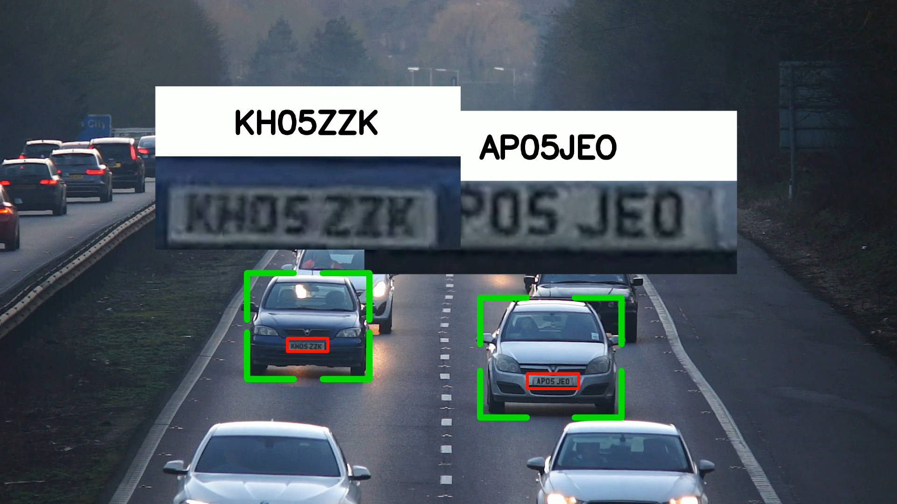

🚗 License Plate Detection & Recognition System

An end-to-end Computer Vision project that detects vehicles, extracts license plates, recognizes plate numbers, and overlays results on video using YOLOv8, OpenCV, and SORT tracking.
---

✨ Features

🔍 Multi-Object Detection – Detects cars, trucks, and motorbikes from traffic videos

📷 License Plate Detection – Extracts plate region using a custom YOLO model

🔡 License Plate Recognition (OCR) – Reads plate text from cropped plates

🛰 Vehicle Tracking – SORT algorithm ensures consistent vehicle IDs across frames

📝 Data Export – Saves results (car IDs, plate numbers, bounding boxes, confidence scores) to CSV

🎥 Visual Output – Overlays bounding boxes + license plate crops + recognized text into the final output video
---
📊 Example Results

Detection + Recognition Overlay

---

🧠 Tech Stack

YOLOv8 – Object & license plate detection

OpenCV – Video processing, drawing overlays, frame manipulation

SORT – Multi-object tracking for vehicles

NumPy / Pandas – Data handling & interpolation

Python – Core implementation
---

📂 Project Workflow

1. Vehicle Detection → Detect vehicles from input video (cars, bikes, trucks)
2. Plate Detection → Detect license plates inside tracked vehicles
3. Plate Recognition → Extract plate ROI, preprocess, and read text
4. Interpolation → Fill missing frames for smoother tracking
5. Visualization → Draw bounding boxes, show cropped plates, overlay recognized text
6. Output → Generate processed video + structured CSV report

---

⚙ Installation

# Clone repo
git clone https://github.com/username/License-Plate-Recognition.git
cd repo-name

# Create virtual environment (optional)
python -m venv venv
source venv/bin/activate    # Linux/Mac
venv\Scripts\activate       # Windows

# Install dependencies
pip install -r requirements.txt

---

🚀 Usage

1. Place your input video in the project directory (e.g., cars.mp4)

2. Run the detection pipeline:

python main.py
python interpolate.py
python visualize. Output:

test.csv → raw results

main.csv → smoothed results

output.mp4 → final video with overlays
---

🙌 Acknowledgements

Ultralytics YOLOv8

OpenCV community

SORT tracking algorithm
---

⚡ Built with passion for Computer Vision & AI 🚀

